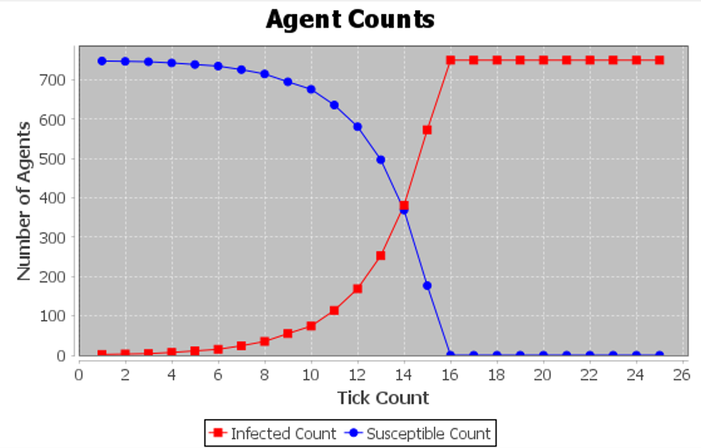
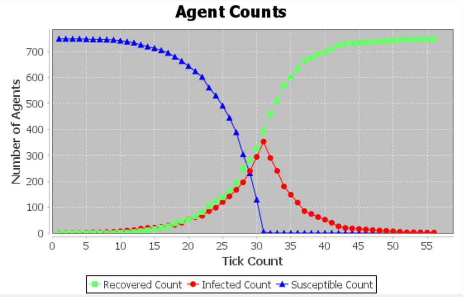
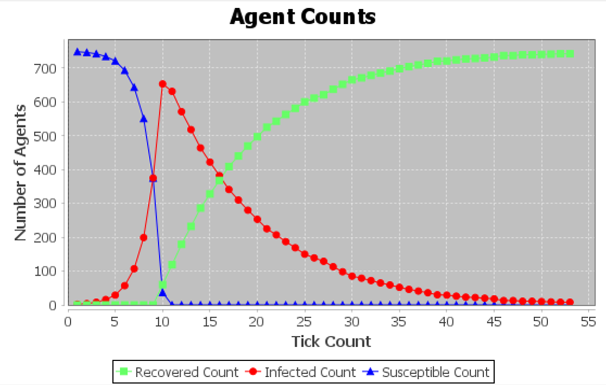
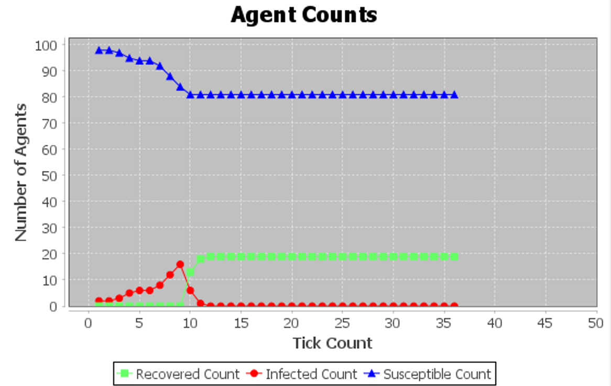

# Disease Spread Simulation

This project simulates the spread of a disease using agent-based modeling (ABM) with Repast Simphony. It includes both traditional fully mixed SI and SIR models (Part A) and social network-based SI and SIR models (Part B).

## Table of Contents

- [Introduction](#introduction)
- [Part A: Traditional Fully Mixed Modeling](#part-a-traditional-fully-mixed-modeling)
- [Part B: Social Network based SI and SIR models](#part-b-social-network-based-si-and-sir-models)

## Introduction

This project aims to visually represent the spread of a disease within a population using ABM. Two modeling approaches are explored: traditional fully mixed modeling and social network-based modeling. The focus is on analyzing the changes in the number of susceptible, infected, and recovered individuals over time for different scenarios.

## Part A: Traditional Fully Mixed Modeling

In this part, the simulation assumes that each agent has the potential to infect all susceptible individuals in the group. The primary goal is to trace changes in the number of susceptible, infected, and recovered individuals over time. Different values of β and γ model parameters are explored.

### SI MODEL

**β  = 0.5**

**N = 750**

### SIR MODEL

**β  = 0.5**

**γ = 0.3**

**N = 750**

**β  = 0.9**

**γ = 0.1**

**N = 750**

**β  = 0.3**

**γ = 0.8**

**N = 750**

### Part B: Social Network based SI and SIR models

Recognizing the limitation of fully mixed models, Part B introduces a synthetic social network to model realistic interactions. Agents can only infect individuals they are directly connected to on the contact network. Synthetic networks are generated using Small World and Barabasi-Albert models.

### BARABASI-ALBERT SI MODEL

**β  = 0.2**

**N = 750**

### BARABASI-ALBERT SIR MODEL

**β  = 0.8**

**γ = 0.3**

**N = 750**
